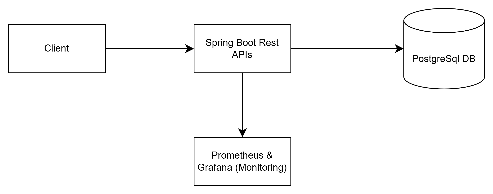

# URL Shortening Service

## Overview
Welcome to the URL Shortening Service project, a robust and scalable solution for shortening long URLs and retrieving the original URLs using RESTful APIs. Built with the power of Spring Boot and Gradle, this application is designed to handle high traffic efficiently and is containerized with Docker for easy deployment. Data persistence is managed through PostgreSQL, ensuring reliable storage and retrieval. For performance monitoring and visualization, Prometheus and Grafana are integrated into the system.

## Technologies Used
- *Spring Boot*: Backend framework providing a robust foundation for building web applications.
- *Gradle*: Efficient build tool for compiling and managing dependencies.
- *PostgreSQL*: Relational database system for data persistence.
- *Docker*: Containerization platform for deploying applications in isolated environments.
- *Prometheus*: Monitoring tool for collecting and analyzing metrics.
- *Grafana*: Visualization tool for creating interactive dashboards and graphs.

## Features
- Shorten long URLs
- Retrieve original URLs using short codes
- Store URL mappings in PostgreSQL
- Monitoring and metrics with Prometheus and Grafana

## How It Works
The service employs a Base62 encryption technique to shorten URLs. Specifically, it takes the hash value generated from the original URL and converts it into a Base62 string. This approach ensures a unique and compact representation of URLs.

## Architecture Diagram



## Setup Instructions
### 1. Clone the Repository
```sh
git clone https://github.com/aparna-panwar/url-shortening.git
cd url-shortener
```

### 2. Configure Environment Variables
Create an `.env` file in the root directory with the following content:
```
POSTGRES_USER=urlshorten_user
POSTGRES_PASSWORD=Q1W2E3R4T5Y6
POSTGRES_DB=urlshortening
```

### 3. Build the Project
```sh
./gradlew clean build
```

### 4. Run with Docker
```sh
docker-compose up -d
```

### 4. Stop Docker
```sh
docker-compose down
```

This will start:
- Spring Boot application
- PostgreSQL database
- Prometheus for monitoring
- Grafana for visualization

### 5. Access the Application
- **API Endpoint**: `http://localhost:8080`
- **Prometheus**: `http://localhost:9090`
- **Grafana**: `http://localhost:3000` (Default credentials: `admin/admin`)

## API Endpoints
### 1. Shorten a long URL
    This API allows you to shorten long URLs by encoding them in Base62 and storing 
    the mapping in a database. If the same URL is provided again, it will return the existing 
    shortened URL from the database.
**Request:**
```http
POST /api/shorten
Content-Type: application/json
{
  "longUrl": "https://mylongurl.com"
}
```
**Response:**
```json
{
  "shortUrl": "http://mytinyurl.com/000002JR"
}
```

### 2. Retrieve Original URL
    This API allows you to retrieve the original URL associated with a given shortened URL. 
    If the shortened URL is not found in the database, the API will throw a UrlNotFoundException.
**Request:**
```http
GET /api/retrieve/{shortUrl}
```
**Response:**
```json
{
  "actualUrl": "https://mylongurl.com"
}
```

## Monitoring with Prometheus & Grafana
### 1. Prometheus
- Scrapes metrics from `http://localhost:8080/actuator/prometheus`
- Default dashboard available at `http://localhost:9090`

### 2. Grafana
- Access at `http://localhost:3000`
- Add Prometheus as a data source (`http://host.docker.internal:9090` inside Docker)
- Import pre-configured dashboards for Spring Boot and PostgreSQL monitoring

## Running Tests
```sh
./gradlew test
```

## Future Enhancements
- Implement caching to store the most frequently accessed original URLs.
- Use caching to store already encrypted values so that when the original URL is received, it can be directly assigned.
- Introduce rate limiting to control the number of requests per URL.
- Add an expiration time for shortened URLs.
- Enable users to create custom short URLs.
- Develop a distributed system to handle high traffic efficiently.